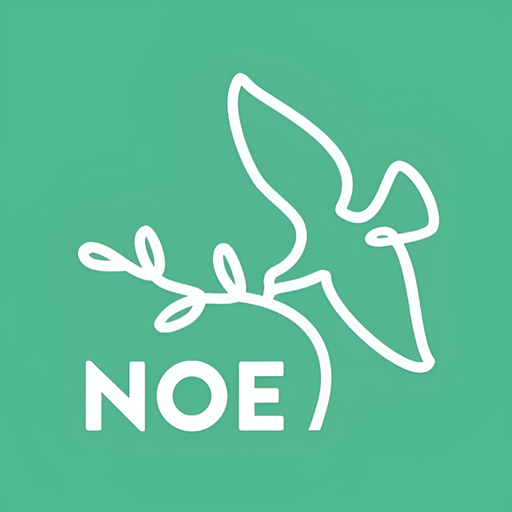

# Kodi doplnok Televízie NOE

### Doplnok obsahuje
 - Relácie z archívu Televízie NOE
 - Živé vysielanie Televízie NOE
 - Živé vysielanie Televízie NOE+
 - 7 dňový prehľad programov na oboch staniciach
 - Vysielanie Televízie Noe bez obmedzení (po príhlásení do klubovej zony)

V prípade otázok / návrhov využite pull request na githube alebo využite fórum xbmc-kodi.cz

#### Doležité informácie
Doplnok čerpá len z voľnedostuoných zdrojov a nevyužíva žiadne iné zdroje ako originálne zdroje z televízie NOE.
Doplnok bol pôvodne iba nástrojom tretej strany, avšak od verzie 1.3.0 je vývoj doplnku v spolupráci s Televíziou Noe.
Kód doplnku je verejne prístupný pre všetkých.

**Upozornenie**: Doplnok je funkčný na verziách KODI 19(matrix) alebo novšie

#### Betatesteri
Chceli by ste sa podieľať na vývoji aj vy? Napíšte príspevok na fórum xbmc-kodi.cz a môžete sa stať jedným s testerov

	

